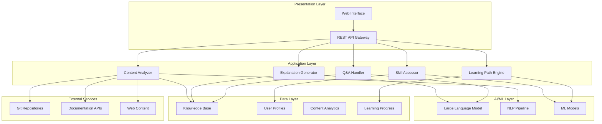

# Design Document: LearnFlow AI

## Overview

LearnFlow AI is a comprehensive AI-powered learning and developer productivity assistant that transforms complex technical content into personalized, digestible learning experiences. The system combines advanced natural language processing, content analysis, and adaptive learning algorithms to provide contextual explanations, step-by-step breakdowns, and personalized learning paths.

The architecture follows a modular, microservices-based approach with clear separation of concerns between content processing, AI inference, user management, and learning analytics. This design enables scalability, maintainability, and the ability to integrate with various content sources and learning platforms.

## Architecture

The system employs a layered architecture with the following key components:



## Components and Interfaces

### Content Analyzer
**Purpose**: Processes and analyzes various types of technical content including code, documentation, and educational materials.

**Key Responsibilities**:
- Parse multiple file formats (markdown, PDF, code files)
- Extract semantic structure and relationships
- Identify key concepts, functions, and dependencies
- Generate content metadata and indexing information

**Interfaces**:
- `analyzeContent(content: ContentInput): AnalysisResult`
- `extractStructure(codebase: Repository): CodeStructure`
- `identifyConcepts(document: Document): ConceptMap`

### Explanation Generator
**Purpose**: Creates personalized, skill-appropriate explanations and breakdowns of complex topics.

**Key Responsibilities**:
- Generate simplified explanations based on user skill level
- Create step-by-step breakdowns of complex processes
- Provide contextual examples and analogies
- Maintain consistency in explanation quality

**Interfaces**:
- `generateExplanation(content: Content, skillLevel: SkillLevel): Explanation`
- `createBreakdown(process: ComplexProcess): StepByStepGuide`
- `provideAnalogy(concept: Concept, userContext: UserContext): Analogy`

### Skill Assessor
**Purpose**: Evaluates and tracks user skill levels across different domains and technologies.

**Key Responsibilities**:
- Conduct initial skill assessments
- Track learning progress and comprehension
- Update skill profiles based on user interactions
- Recommend appropriate difficulty levels

**Interfaces**:
- `assessSkill(user: User, domain: Domain): SkillLevel`
- `updateProgress(user: User, activity: LearningActivity): void`
- `recommendDifficulty(user: User, topic: Topic): DifficultyLevel`

### Learning Path Engine
**Purpose**: Creates and manages personalized learning sequences tailored to individual users.

**Key Responsibilities**:
- Generate customized learning paths
- Sequence topics from basic to advanced
- Adapt paths based on user progress
- Recommend prerequisite topics

**Interfaces**:
- `createLearningPath(goal: LearningGoal, user: User): LearningPath`
- `updatePath(path: LearningPath, progress: Progress): LearningPath`
- `recommendPrerequisites(topic: Topic, user: User): Topic[]`

### Q&A Handler
**Purpose**: Manages interactive question-answering and clarification requests.

**Key Responsibilities**:
- Process user questions in context
- Provide relevant, contextual answers
- Maintain conversation history
- Suggest related topics and clarifications

**Interfaces**:
- `answerQuestion(question: Question, context: Context): Answer`
- `provideClarification(topic: Topic, user: User): Clarification`
- `suggestRelatedTopics(currentTopic: Topic): Topic[]`

## Data Models

### User Profile
```typescript
interface UserProfile {
  id: string;
  skillLevels: Map<Domain, SkillLevel>;
  learningPreferences: LearningPreferences;
  progressHistory: ProgressRecord[];
  currentPaths: LearningPath[];
  createdAt: Date;
  updatedAt: Date;
}

interface SkillLevel {
  domain: string;
  level: 'beginner' | 'intermediate' | 'advanced' | 'expert';
  confidence: number; // 0-1
  lastAssessed: Date;
}
```

### Content Structure
```typescript
interface ContentStructure {
  id: string;
  type: 'code' | 'documentation' | 'tutorial';
  source: string;
  metadata: ContentMetadata;
  concepts: Concept[];
  relationships: Relationship[];
  difficulty: DifficultyLevel;
  processedAt: Date;
}

interface Concept {
  id: string;
  name: string;
  description: string;
  category: string;
  prerequisites: string[];
  examples: Example[];
}
```

### Learning Path
```typescript
interface LearningPath {
  id: string;
  userId: string;
  goal: LearningGoal;
  steps: LearningStep[];
  currentStep: number;
  progress: number; // 0-100
  estimatedDuration: number; // minutes
  createdAt: Date;
  updatedAt: Date;
}

interface LearningStep {
  id: string;
  title: string;
  content: Content;
  exercises: Exercise[];
  checkpoints: Checkpoint[];
  completed: boolean;
  timeSpent: number;
}
```

### Explanation
```typescript
interface Explanation {
  id: string;
  contentId: string;
  targetSkillLevel: SkillLevel;
  simplifiedText: string;
  breakdown: Step[];
  examples: Example[];
  analogies: Analogy[];
  relatedConcepts: string[];
  generatedAt: Date;
}

interface Step {
  order: number;
  title: string;
  description: string;
  codeExample?: CodeSnippet;
  visualAid?: string;
}
```

## Correctness Properties

*A property is a characteristic or behavior that should hold true across all valid executions of a system—essentially, a formal statement about what the system should do. Properties serve as the bridge between human-readable specifications and machine-verifiable correctness guarantees.*

### Property 1: Content Analysis Completeness
*For any* valid input content (code, documentation, or educational material), the Content_Analyzer should successfully parse the content and extract structural information including concepts, relationships, and metadata.
**Validates: Requirements 1.1, 1.2, 1.3, 1.4**

### Property 2: Multi-Language Code Support
*For any* valid code file in Python, JavaScript, TypeScript, Java, or Go, the Content_Analyzer should successfully extract function signatures, class definitions, and dependencies.
**Validates: Requirements 1.5, 1.3**

### Property 3: Skill-Appropriate Explanation Generation
*For any* content and user skill level combination, the Explanation_Generator should produce explanations with complexity and vocabulary appropriate to the specified skill level.
**Validates: Requirements 2.1, 2.2**

### Property 4: Code Explanation Completeness
*For any* code snippet, the generated explanation should include line-by-line breakdowns with plain language descriptions for all significant code elements.
**Validates: Requirements 2.3**

### Property 5: Documentation Summarization Quality
*For any* documentation content, the generated explanation should include identified key takeaways and relevant examples or analogies.
**Validates: Requirements 2.4, 2.5**

### Property 6: Skill Tracking Consistency
*For any* user interaction with learning content, the Skill_Assessor should update the user's skill profile and adjust future content recommendations accordingly.
**Validates: Requirements 3.2, 3.3**

### Property 7: Multi-Domain Skill Management
*For any* user, the system should maintain separate skill levels across different domains (programming languages, frameworks, concepts) and provide domain-specific recommendations.
**Validates: Requirements 3.4, 3.5**

### Property 8: Learning Path Progression
*For any* learning goal and user profile, the generated learning path should sequence topics from basic to advanced concepts and include practical exercises and checkpoints.
**Validates: Requirements 4.1, 4.2, 4.5**

### Property 9: Adaptive Path Management
*For any* learning path, when users complete segments or encounter advanced concepts, the system should update the path and recommend prerequisites as needed.
**Validates: Requirements 4.3, 4.4**

### Property 10: Contextual Q&A Response
*For any* user question about content, the system should provide contextual answers that maintain conversation history and offer appropriate clarifications or alternative explanations.
**Validates: Requirements 5.1, 5.2, 5.4**

### Property 11: Question Complexity Handling
*For any* complex question or user struggle indication, the system should break down the question into manageable parts and suggest simpler prerequisite topics.
**Validates: Requirements 5.3, 5.5**

### Property 12: Comprehensive Progress Tracking
*For any* completed learning activity, the system should record progress including comprehension metrics, time spent, topics mastered, and generate appropriate visual reports and analytics.
**Validates: Requirements 6.1, 6.2, 6.3, 6.5**

### Property 13: Knowledge Gap Analysis
*For any* user's learning progress, the system should identify knowledge gaps and suggest relevant review materials.
**Validates: Requirements 6.4**

### Property 14: Multi-Format Content Processing
*For any* supported content format (text documents, code repositories, URLs, markdown, PDF, plain text), the system should process and explain the content while maintaining consistent explanation quality.
**Validates: Requirements 7.1, 7.2, 7.3, 7.4, 7.5**

### Property 15: Knowledge Base Storage and Versioning
*For any* processed content, the Knowledge_Base should store explanations with metadata, maintain version control for updates, and incorporate user feedback to improve quality.
**Validates: Requirements 8.1, 8.2, 8.3**

### Property 16: Content Organization and Search
*For any* content in the Knowledge_Base, it should be organized by topics, difficulty levels, and user preferences, and search queries should return relevant, properly ranked results.
**Validates: Requirements 8.4, 8.5**

## Error Handling

The system implements comprehensive error handling across all components:

### Content Processing Errors
- **Invalid File Formats**: Return descriptive error messages for unsupported formats
- **Parsing Failures**: Gracefully handle malformed content with partial analysis results
- **Large File Handling**: Implement size limits and streaming for large repositories
- **Network Timeouts**: Retry mechanisms for URL-based content fetching

### AI/ML Model Errors
- **Model Unavailability**: Fallback to cached explanations or simplified responses
- **Generation Failures**: Retry with adjusted parameters or alternative models
- **Context Length Limits**: Implement content chunking and summarization strategies
- **Rate Limiting**: Queue management and user notification for API limits

### User Data Errors
- **Profile Corruption**: Automatic backup restoration and profile reconstruction
- **Skill Assessment Failures**: Default to conservative skill level estimates
- **Progress Tracking Issues**: Maintain data integrity with transaction rollbacks
- **Authentication Errors**: Secure session management and token refresh

### System Integration Errors
- **Database Connectivity**: Connection pooling and automatic reconnection
- **External API Failures**: Circuit breaker patterns and graceful degradation
- **Cache Invalidation**: Consistent cache management and refresh strategies
- **Concurrent Access**: Proper locking mechanisms and conflict resolution

## Testing Strategy

The testing approach combines unit testing for specific functionality with property-based testing for universal correctness guarantees.

### Unit Testing Approach
Unit tests focus on:
- **Specific Examples**: Concrete test cases that demonstrate correct behavior
- **Edge Cases**: Boundary conditions, empty inputs, and error scenarios  
- **Integration Points**: Component interactions and data flow validation
- **Error Conditions**: Exception handling and graceful failure modes

### Property-Based Testing Configuration
- **Testing Framework**: Use Hypothesis for Python or fast-check for TypeScript/JavaScript
- **Test Iterations**: Minimum 100 iterations per property test to ensure comprehensive coverage
- **Test Tagging**: Each property test tagged with format: **Feature: learnflow-ai, Property {number}: {property_text}**
- **Generator Strategy**: Smart generators that constrain inputs to valid domain spaces

### Dual Testing Benefits
- **Unit Tests**: Catch specific bugs and validate concrete examples
- **Property Tests**: Verify universal properties across all possible inputs
- **Comprehensive Coverage**: Together provide both specific validation and general correctness
- **Regression Prevention**: Property tests catch edge cases that unit tests might miss

### Testing Implementation Requirements
- Each correctness property must be implemented as a single property-based test
- Property tests must reference their corresponding design document property
- Test generators should intelligently constrain input spaces for realistic scenarios
- All tests must validate real functionality without mocking core business logic